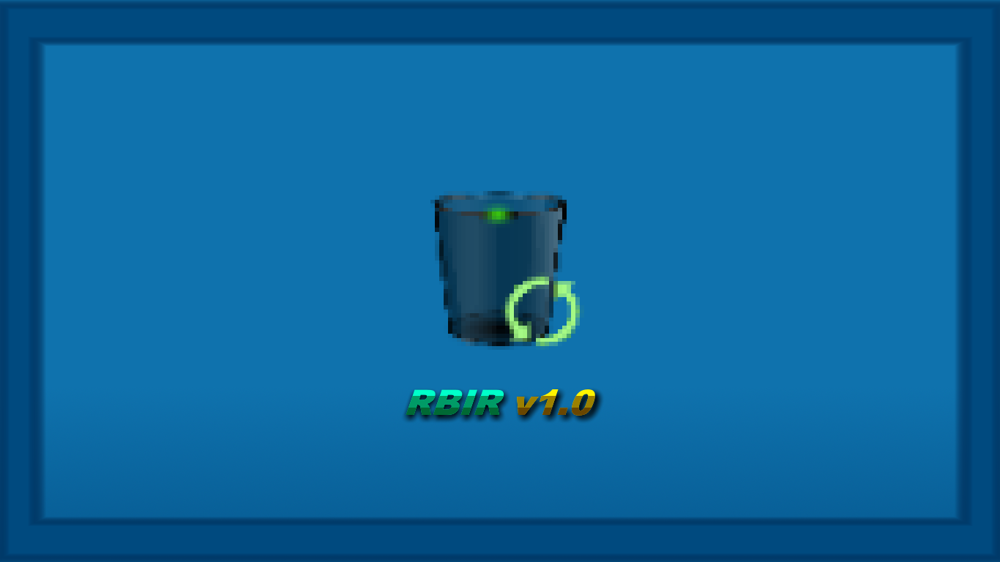
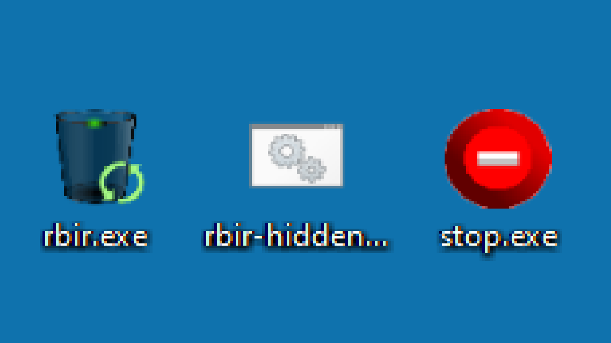

# Recycle-Bin-Icon-Refresher
I introduce you the RBIR v1.0

This application provides an automatic icon refresh for recycle bin.

Description:

If recycle bin is full/empty it'll automatically refresh the desktop so it will automatically change the icon without being manually refresh.

If you want the application to run hidden then open (rbir-hidden.bat).

To stop the application just simply open the (stop.exe).

If icon didn't change or there's no changes just manually refresh the desktop once.

You shouldn't change filename & extension.

Feel free to send your feedback at my gmail: techlord4lyfans@gmail.com
